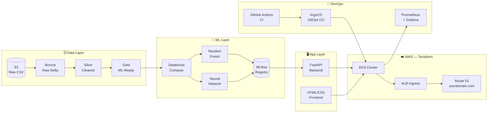

<div align="center">

# 🚀 End-to-End MLOps — Customer Churn Prediction

**A complete, production-grade MLOps pipeline: raw CSV → trained model → live API → Kubernetes**

[](https://python.org)
[](https://fastapi.tiangolo.com)
[](https://databricks.com)
[](https://aws.amazon.com)
[](https://terraform.io)
[](https://argoproj.github.io)
[](LICENSE)

<br/>

> Build the **same stack used at top ML teams** — step-by-step, from an empty folder to a live prediction API with CI/CD, GitOps, code quality gates, and full observability.
> Every command is copy-pasteable. Every concept is explained.

<br/>

[**🟢 Start here — 5 min quickstart**](#-level-1--local-docker-no-accounts-needed) &nbsp;·&nbsp;
[**📖 Full phase guide**](#-phase-by-phase-guide) &nbsp;·&nbsp;
[**⚙️ What to configure**](#️-configuration-reference) &nbsp;·&nbsp;
[**💰 Cost breakdown**](#-cost-breakdown)

</div>

---

## 📐 Architecture Overview



### What's inside

| Layer | Technology | What it does |
|---|---|---|
| **Data ingestion** | Databricks Auto Loader | Reads CSV files from S3 incrementally, append-only |
| **Data quality** | Delta Lake — Bronze → Silver → Gold | Progressive refinement, deduplication, quarantine |
| **ML training** | scikit-learn + Keras on Databricks | Trains Random Forest + Neural Network, tracks with MLflow |
| **Model registry** | MLflow on Unity Catalog | Registers the best model; backend loads `@production` alias |
| **Backend** | FastAPI + Prometheus | `/predict`, `/health`, `/ready`, `/metrics` endpoints |
| **Frontend** | HTML + CSS + Vanilla JS | Form UI served by NGINX that calls the backend |
| **Containers** | Docker multi-stage builds | Slim, non-root images for both services |
| **Infrastructure** | Terraform on AWS | VPC, private/public subnets, NAT GW, EKS, ALB |
| **DNS + TLS** | Route 53 + ACM | Custom domain with HTTPS — free certificate |
| **CI** | GitHub Actions | Tests, lint, Docker build + push to ECR, tag bump |
| **CD** | ArgoCD | GitOps — git is the single source of truth |
| **Code quality** | SonarQube / SonarCloud | Quality gates on every PR |
| **Monitoring** | Prometheus + Grafana | Request rate, latency p99, prediction drift signals |

---

## 🗺️ Three Levels — Pick Yours

| Level | ⏱ Time | Accounts needed | What you get |
|---|---|---|---|
| [🟢 **Level 1 — Local Docker**](#-level-1--local-docker-no-accounts-needed) | 5 min | None | Working UI + mock model on your laptop |
| [🟡 **Level 2 — Real Model**](#-level-2--real-model-with-databricks) | ~2 hrs | Databricks (free trial) | Real churn predictions from a trained ML model |
| [🔴 **Level 3 — Full Cloud**](#-level-3--full-aws-deployment) | ~4 hrs | AWS + Databricks | Live at `https://app.yourdomain.com` |

---

## ✅ Prerequisites

Install these tools before you begin.

| Tool | Min version | How to check | Install guide |
|---|---|---|---|
| [Docker](https://docs.docker.com/get-docker/) | 24+ | `docker --version` | [docs.docker.com/get-docker](https://docs.docker.com/get-docker/) |
| [Git](https://git-scm.com) | any | `git --version` | [git-scm.com](https://git-scm.com) |
| [AWS CLI](https://aws.amazon.com/cli/) | v2 | `aws --version` | [aws.amazon.com/cli](https://aws.amazon.com/cli/) |
| [Terraform](https://developer.hashicorp.com/terraform/install) | 1.6+ | `terraform --version` | [developer.hashicorp.com](https://developer.hashicorp.com/terraform/install) |
| [kubectl](https://kubernetes.io/docs/tasks/tools/) | 1.29+ | `kubectl version --client` | [kubernetes.io/docs/tasks/tools](https://kubernetes.io/docs/tasks/tools/) |
| [Helm](https://helm.sh/docs/intro/install/) | 3.13+ | `helm version` | [helm.sh](https://helm.sh/docs/intro/install/) |
| [Python](https://python.org) | 3.10+ | `python --version` | [python.org](https://python.org) |

> 💡 **Windows users:** Use [WSL2](https://learn.microsoft.com/en-us/windows/wsl/install). All commands below assume a Unix shell (bash/zsh).

---

## 🟢 Level 1 — Local Docker (No accounts needed)

> **Goal:** See the full UI and prediction flow running on your laptop in under 5 minutes, using a built-in mock model. No AWS, no Databricks, no configuration.

### Step 1 — Clone the repo

```bash
git clone https://github.com/YOUR-USERNAME/mlops-e2e.git
cd mlops-e2e
```

### Step 2 — Start everything with one command

```bash
docker compose up --build
```

Wait ~60 seconds for both images to build. When you see these lines, everything is ready:

```
churn-backend   | INFO:     Application startup complete.
churn-frontend  | ... nginx: master process nginx ...
```

### Step 3 — Open the app

| URL | What you see |
|---|---|
| **http://localhost:8080** | 🎯 The churn prediction UI |
| **http://localhost:8000/docs** | 📚 Interactive API docs (Swagger UI) |
| **http://localhost:8000/health** | `{"status":"ok"}` |
| **http://localhost:8000/metrics** | Raw Prometheus metrics |

### Step 4 — Make your first prediction

1. Open **http://localhost:8080**
2. The banner at the top shows the model info (mock model in Level 1)
3. Fill in the customer form — or leave the defaults
4. Click **"Predict churn →"**
5. You'll see: **⚠️ Likely to CHURN** or **✅ Likely to STAY** with a confidence percentage

> ✅ **Level 1 complete!** The mock model uses a rule-based predictor (month-to-month contract + tenure < 12 months → churn). For a real ML model, continue to Level 2.

---

## 🟡 Level 2 — Real Model with Databricks

> **Goal:** Train an actual Random Forest and Neural Network on Databricks, register the best one in MLflow, and serve it locally through the same Docker setup.

### Step 1 — Create a Databricks account

1. Go to **https://www.databricks.com/try-databricks**
2. Sign up — select **AWS** as the cloud and **Premium** as the plan
   *(Premium is needed for Unity Catalog — it's included in the free 14-day trial)*
3. After ~10 minutes you'll receive a workspace URL like:
   `https://dbc-xxxxxxxx.cloud.databricks.com`

### Step 2 — Generate a Databricks access token

```
Databricks workspace
  → Click your avatar (top right)
  → Settings
  → Developer → Access Tokens
  → "Generate New Token"
  → Name: mlops-tutorial   Lifetime: 90 days
  → Click Generate
  → COPY the token (starts with "dapi...") — you can't see it again!
```

### Step 3 — Create an AWS account and S3 bucket

> You need an AWS account for S3. The S3 cost for this dataset is **less than $0.01/month**.

```bash
# 1. Configure your AWS credentials
aws configure
#   AWS Access Key ID:     [paste yours]
#   AWS Secret Access Key: [paste yours]
#   Default region:        us-east-1
#   Default output format: json

# 2. Pick a unique suffix (your initials + a number works fine)
export SUFFIX="abc123"    # ← CHANGE THIS

# 3. Create the S3 bucket for raw data
aws s3api create-bucket \
    --bucket "mlops-churn-raw-${SUFFIX}" \
    --region us-east-1

# 4. Upload the included sample dataset
aws s3 cp sample_data/customer_churn_raw.csv \
    "s3://mlops-churn-raw-${SUFFIX}/landing/customer_churn_raw.csv"

# 5. Verify the upload worked
aws s3 ls "s3://mlops-churn-raw-${SUFFIX}/landing/"
# Expected: ... customer_churn_raw.csv
```

### Step 4 — Configure the backend with your credentials

```bash
cp backend/.env.example backend/.env
```

Open `backend/.env` and fill in **only these three lines** (everything else stays as-is):

```bash
DATABRICKS_HOST=https://dbc-xxxxxxxx.cloud.databricks.com  # ← your workspace URL
DATABRICKS_TOKEN=dapixxxxxxxxxxxxxxxxxxxxxxxxxxxxxxxx        # ← your token from Step 2
MOCK_MODEL=false
```

### Step 5 — Set up Unity Catalog in Databricks

Follow **[docs/02-databricks-setup.md](docs/02-databricks-setup.md)** to:
- Enable Unity Catalog (5-minute setup in the Databricks account console)
- Create an IAM role to give Databricks read access to your S3 bucket
- Create the catalog + schemas

Then run the first notebook in your Databricks workspace:

```
Databricks workspace
  → New → Import
  → Upload: databricks/00_setup_unity_catalog.py
  → Attach a cluster (Runtime: 15.4 LTS ML)
  → Set the widget: raw_bucket = mlops-churn-raw-abc123   ← your suffix
  → Click "Run All"
  → All cells should show green checkmarks
```

### Step 6 — Run the data pipeline

Run these three notebooks **in order**. For each one: upload → attach cluster → set the `raw_bucket` widget → Run All.

| Notebook | What it does | Expected output |
|---|---|---|
| `01_ingest_bronze.py` | Reads CSV from S3 → Bronze Delta table | "Bronze rows: 20" |
| `02_silver_clean.py` | Validates and cleans → Silver table | "Silver rows (after dedup): 19" |
| `03_gold_features.py` | Feature engineering → Gold table | Shows train/val/test split counts |

### Step 7 — Train the models

Run these notebooks (each takes 2–5 minutes):

| Notebook | What it does |
|---|---|
| `04_train_random_forest.py` | Trains 3 RF configurations, logs all to MLflow |
| `05_train_neural_network.py` | Trains 3 NN configurations, logs all to MLflow |
| `06_register_best_model.py` | Compares all runs, registers the winner as `@production` |

After notebook 06 completes:
```
Databricks → Catalog → churn_mlops → models → churn_classifier
→ You should see: Version 1, alias: @production ✅
```

### Step 8 — Run the app with the real model

```bash
# Restart docker compose — it now reads MOCK_MODEL=false from backend/.env
docker compose up --build
```

The backend takes ~30 seconds to start (it downloads the model from Databricks). The banner in the UI will now show the real model version number.

> ✅ **Level 2 complete!** You have a real ML model making predictions. Continue to Level 3 to deploy it to the cloud.

---

## 🔴 Level 3 — Full AWS Deployment

> **Goal:** Deploy everything to AWS EKS. Get a live URL (`https://app.yourdomain.com`) with CI/CD, monitoring, and code quality gates.
>
> 💸 **Cost warning:** This creates real AWS resources. Estimated cost: **$5–10 per day**. Always run `terraform destroy` when done experimenting.

### Step 1 — Fork and clone this repo

```bash
# 1. Click "Fork" on GitHub (top right of this page)
# 2. Clone YOUR fork:
git clone https://github.com/YOUR-USERNAME/mlops-e2e.git
cd mlops-e2e
```

### Step 2 — Create the Terraform state backend

```bash
export SUFFIX="abc123"    # ← same suffix you used in Level 2
export REGION="us-east-1"

# S3 bucket for Terraform state (needs versioning for safety)
aws s3api create-bucket \
    --bucket "mlops-tfstate-${SUFFIX}" \
    --region $REGION

aws s3api put-bucket-versioning \
    --bucket "mlops-tfstate-${SUFFIX}" \
    --versioning-configuration Status=Enabled

# DynamoDB table for state locking (prevents concurrent apply conflicts)
aws dynamodb create-table \
    --table-name mlops-tflock \
    --attribute-definitions AttributeName=LockID,AttributeType=S \
    --key-schema AttributeName=LockID,KeyType=HASH \
    --billing-mode PAY_PER_REQUEST \
    --region $REGION

echo "Done. Wait 10 seconds..."
sleep 10
aws dynamodb wait table-exists --table-name mlops-tflock --region $REGION
echo "Table is ready ✅"
```

### Step 3 — Configure Terraform

**Edit `terraform/providers.tf`** — find line 23 and update the bucket name:

```hcl
# Find this:
bucket = "mlops-tfstate-CHANGEME"

# Replace with YOUR suffix:
bucket = "mlops-tfstate-abc123"
```

**Create `terraform/terraform.tfvars`** from the example:

```bash
cp terraform/terraform.tfvars.example terraform/terraform.tfvars
```

Open `terraform/terraform.tfvars` and set your values:

```hcl
aws_region   = "us-east-1"      # ← your AWS region
project      = "churn-mlops"
environment  = "dev"

# Leave blank for now — you can add a custom domain later (Step 9)
domain_name         = ""
app_subdomain       = "app"
acm_certificate_arn = ""
```

### Step 4 — Provision the infrastructure (~20 min)

```bash
cd terraform

# Download all Terraform modules (first time only, takes ~1 min)
terraform init

# Preview everything that will be created
terraform plan

# Create it all (EKS takes ~15 min to provision)
terraform apply
# Type "yes" when prompted and press Enter
```

When it finishes you'll see:
```
Outputs:
cluster_name       = "churn-mlops-eks"
kubeconfig_command = "aws eks update-kubeconfig --region us-east-1 --name churn-mlops-eks"
```

### Step 5 — Connect kubectl to your new cluster

```bash
# Run the exact command from the Terraform output:
aws eks update-kubeconfig --region us-east-1 --name churn-mlops-eks

# Verify nodes are ready (takes up to 5 min after terraform finishes)
kubectl get nodes
# Expected output:
# NAME                           STATUS   ROLES    AGE   VERSION
# ip-10-0-11-xxx.ec2.internal    Ready    <none>   3m    v1.30.x
# ip-10-0-12-xxx.ec2.internal    Ready    <none>   3m    v1.30.x
```

### Step 6 — Build and push Docker images to ECR

```bash
ACCOUNT_ID=$(aws sts get-caller-identity --query Account --output text)
REGION="us-east-1"

# Create ECR repositories
aws ecr create-repository --repository-name churn-backend  --region $REGION
aws ecr create-repository --repository-name churn-frontend --region $REGION

# Log Docker into ECR
aws ecr get-login-password --region $REGION \
  | docker login --username AWS --password-stdin \
    "${ACCOUNT_ID}.dkr.ecr.${REGION}.amazonaws.com"

# Build and push both images
TAG=$(git rev-parse --short HEAD)

docker build -t "${ACCOUNT_ID}.dkr.ecr.${REGION}.amazonaws.com/churn-backend:${TAG}"  backend/
docker push  "${ACCOUNT_ID}.dkr.ecr.${REGION}.amazonaws.com/churn-backend:${TAG}"

docker build -t "${ACCOUNT_ID}.dkr.ecr.${REGION}.amazonaws.com/churn-frontend:${TAG}" frontend/
docker push  "${ACCOUNT_ID}.dkr.ecr.${REGION}.amazonaws.com/churn-frontend:${TAG}"

echo "Images pushed with tag: $TAG"
```

### Step 7 — Update Kubernetes manifests with your image URIs

```bash
# Replace the placeholder text in the deployment files with your real ECR URIs
sed -i "s|REPLACE_ME_ECR_BACKEND_URI|${ACCOUNT_ID}.dkr.ecr.${REGION}.amazonaws.com/churn-backend|" \
    k8s/backend/deployment.yaml

sed -i "s|REPLACE_ME_ECR_FRONTEND_URI|${ACCOUNT_ID}.dkr.ecr.${REGION}.amazonaws.com/churn-frontend|" \
    k8s/frontend/deployment.yaml

# Verify the replacements worked
grep "image:" k8s/backend/deployment.yaml
grep "image:" k8s/frontend/deployment.yaml
```

### Step 8 — Deploy to Kubernetes

```bash
# Create namespace and store Databricks credentials as a secret
kubectl create namespace churn

kubectl -n churn create secret generic databricks-creds \
    --from-literal=DATABRICKS_HOST="https://dbc-xxxxxxxx.cloud.databricks.com" \
    --from-literal=DATABRICKS_TOKEN="dapixxxxxxxxxxxxxxxxxxxxxxxxxxxxxxxx"

# Apply all manifests
kubectl apply -f k8s/namespace.yaml
kubectl apply -f k8s/backend/deployment.yaml
kubectl apply -f k8s/backend/service.yaml
kubectl apply -f k8s/frontend/deployment.yaml
kubectl apply -f k8s/frontend/service.yaml
kubectl apply -f k8s/ingress.yaml

# Watch pods come up (~2 min)
kubectl get pods -n churn -w
# Wait until all show: Running  1/1
```

### Step 9 — Get your app URL

```bash
# Watch for the ALB to be provisioned (~3 min after ingress is applied)
kubectl get ingress -n churn -w
# When ADDRESS column is populated, the ALB is ready

# Get the URL
ALB_URL=$(kubectl get ingress -n churn \
    -o jsonpath='{.items[0].status.loadBalancer.ingress[0].hostname}')
echo "Your app is at: http://$ALB_URL"

# Test it
curl "http://$ALB_URL/api/health"
# {"status":"ok"}
```

Open `http://$ALB_URL` in your browser — **your ML app is live on the internet!** 🎉

> ✅ **Level 3 core done!** For a custom domain, CI/CD pipeline, and monitoring — continue with the bonus sections below.

---

## ⚙️ Configuration Reference

> Every placeholder you need to replace, in one place. Nothing else in the code needs to change.

| # | File | Find this | Replace with |
|---|---|---|---|
| 1 | `terraform/providers.tf` line 23 | `mlops-tfstate-CHANGEME` | `mlops-tfstate-<your-suffix>` |
| 2 | `terraform/terraform.tfvars` | `aws_region`, `domain_name` | Your region + domain (e.g. `example.com`) |
| 3 | `backend/.env` | `DATABRICKS_HOST`, `DATABRICKS_TOKEN` | Your Databricks workspace URL + token |
| 4 | `k8s/backend/deployment.yaml` | `REPLACE_ME_ECR_BACKEND_URI` | Your ECR backend image URI |
| 5 | `k8s/frontend/deployment.yaml` | `REPLACE_ME_ECR_FRONTEND_URI` | Your ECR frontend image URI |
| 6 | `k8s/ingress.yaml` | `app.example.com` | `app.<your-domain>.com` |
| 7 | `k8s/argocd-apps/*.yaml` | `<your-user>` in `repoURL` | Your GitHub username |
| 8 | `sonar-project.properties` | `<your-org>` | Your SonarCloud organization key |
| 9 | GitHub repo Secrets (UI) | — | `AWS_ROLE_ARN`, `SONAR_TOKEN` |
| 10 | GitHub repo Variables (UI) | — | `AWS_REGION`, `AWS_ACCOUNT_ID` |

---

## 🔄 Bonus A — Automatic CI/CD (GitHub Actions + ArgoCD)

<details>
<summary><b>Click to expand — every push to main auto-deploys to EKS</b></summary>

### How the pipeline works

```
You push code
  → GitHub Actions runs tests + lint
  → Builds new Docker image, pushes to ECR
  → Updates image tag in k8s/ manifests
  → Commits the updated manifest back to main
  → ArgoCD detects the new commit within 3 minutes
  → ArgoCD applies the manifest → rolling deploy on EKS
```

### Step A1 — Set up GitHub → AWS trust (OIDC — no long-lived keys)

```bash
ACCOUNT_ID=$(aws sts get-caller-identity --query Account --output text)
GH_USER="YOUR-GITHUB-USERNAME"   # ← change this

# Register GitHub as a trusted identity provider in AWS
aws iam create-open-id-connect-provider \
  --url "https://token.actions.githubusercontent.com" \
  --client-id-list "sts.amazonaws.com" \
  --thumbprint-list "6938fd4d98bab03faadb97b34396831e3780aea1"

# Create the trust policy file
cat > /tmp/gh-trust.json <<EOF
{
  "Version": "2012-10-17",
  "Statement": [{
    "Effect": "Allow",
    "Principal": {
      "Federated": "arn:aws:iam::${ACCOUNT_ID}:oidc-provider/token.actions.githubusercontent.com"
    },
    "Action": "sts:AssumeRoleWithWebIdentity",
    "Condition": {
      "StringEquals": {
        "token.actions.githubusercontent.com:aud": "sts.amazonaws.com"
      },
      "StringLike": {
        "token.actions.githubusercontent.com:sub": "repo:${GH_USER}/mlops-e2e:*"
      }
    }
  }]
}
EOF

# Create the IAM role
aws iam create-role \
    --role-name gh-mlops-e2e \
    --assume-role-policy-document file:///tmp/gh-trust.json

# Give it permission to push to ECR
aws iam attach-role-policy \
    --role-name gh-mlops-e2e \
    --policy-arn arn:aws:iam::aws:policy/AmazonEC2ContainerRegistryPowerUser

# Print the role ARN — you'll need it in the next step
aws iam get-role --role-name gh-mlops-e2e --query Role.Arn --output text
```

### Step A2 — Add secrets to GitHub

Go to: **Your repo → Settings → Secrets and variables → Actions**

Add **Secrets** (these are encrypted, never visible again):

| Name | Value |
|---|---|
| `AWS_ROLE_ARN` | The ARN from Step A1 (e.g. `arn:aws:iam::123456789012:role/gh-mlops-e2e`) |
| `SONAR_TOKEN` | Your SonarCloud token (from Bonus C below) |

Add **Variables** (these are visible, not sensitive):

| Name | Value |
|---|---|
| `AWS_REGION` | `us-east-1` |
| `AWS_ACCOUNT_ID` | Your 12-digit AWS account number |

### Step A3 — Set up ArgoCD apps

```bash
# Update the Git repo URL in all ArgoCD Application files
sed -i "s|<your-user>|${GH_USER}|g" k8s/argocd-apps/*.yaml

# Commit the change
git add k8s/argocd-apps/
git commit -m "config: set argocd repo URL"
git push

# Apply the ArgoCD app definitions
kubectl apply -f k8s/argocd-apps/

# Check status (all should show Synced / Healthy within 3 min)
kubectl get applications -n argocd
```

### Step A4 — Enable branch protection

Go to: **Your repo → Settings → Branches → Add rule for `main`**

Enable:
- ✅ **Require status checks to pass before merging**
  - Add: `CI / Backend lint + tests`
- ✅ **Require branches to be up to date before merging**
- ✅ **Require a pull request review** (optional but recommended)

### From now on — the full automated flow

```bash
# Make a change
echo "# my change" >> backend/app/main.py
git add -A && git commit -m "feat: my change" && git push origin my-branch

# Open a PR on GitHub
# → CI runs automatically (tests, lint, sonar)
# → Merge the PR when green
# → Docker image is built and pushed to ECR
# → k8s manifest is updated with the new image tag
# → ArgoCD detects the change and rolls out to EKS within 3 min
```

</details>

---

## 🌐 Bonus B — Custom Domain + HTTPS

<details>
<summary><b>Click to expand — get https://app.yourdomain.com with a free TLS certificate</b></summary>

### Step B1 — Request a free TLS certificate from ACM

```bash
# Replace with your actual domain
DOMAIN="yourdomain.com"

aws acm request-certificate \
    --domain-name "*.${DOMAIN}" \
    --validation-method DNS \
    --region us-east-1
```

Then in the AWS Console:
```
ACM → Your certificate → "Create records in Route 53"
→ Wait ~5 minutes → Status changes to "Issued" ✅
```

Copy the certificate ARN (looks like `arn:aws:acm:us-east-1:123456789012:certificate/xxx`).

### Step B2 — Update the Ingress with TLS

Edit `k8s/ingress.yaml` — uncomment the HTTPS lines and fill in your values:

```yaml
# Uncomment these lines:
alb.ingress.kubernetes.io/listen-ports: '[{"HTTPS":443},{"HTTP":80}]'
alb.ingress.kubernetes.io/certificate-arn: arn:aws:acm:us-east-1:YOUR-CERT-ARN
alb.ingress.kubernetes.io/ssl-redirect: '443'

# Update the host:
- host: app.yourdomain.com
```

Apply:
```bash
kubectl apply -f k8s/ingress.yaml
```

### Step B3 — Point your domain at the ALB

```bash
# Update terraform.tfvars with your domain and cert:
# domain_name         = "yourdomain.com"
# app_subdomain       = "app"
# acm_certificate_arn = "arn:aws:acm:us-east-1:...:certificate/..."

terraform apply -target=aws_route53_record.app
```

Wait ~60 seconds. Then test:

```bash
curl https://app.yourdomain.com/api/health
# {"status":"ok"}
```

Open `https://app.yourdomain.com` in your browser — you now have HTTPS. 🔒

</details>

---

## 📊 Bonus C — Monitoring with Prometheus + Grafana

<details>
<summary><b>Click to expand — dashboards for request rate, latency, and model predictions</b></summary>

### Step C1 — Install the monitoring stack

```bash
# Add the Helm repo
helm repo add prometheus-community \
    https://prometheus-community.github.io/helm-charts
helm repo update

# Install Prometheus + Grafana + Alertmanager (~3 min)
helm install kps prometheus-community/kube-prometheus-stack \
    -n monitoring --create-namespace \
    -f k8s/monitoring/prometheus-values.yaml

# Watch pods come up
kubectl -n monitoring get pods -w
# Wait until all show Running
```

### Step C2 — Enable scraping for the backend

```bash
kubectl apply -f k8s/monitoring/backend-servicemonitor.yaml
```

This tells Prometheus to scrape `/metrics` on the backend pods every 15 seconds.

### Step C3 — Open Grafana and import the dashboard

```bash
# Port-forward Grafana to your laptop
kubectl -n monitoring port-forward svc/kps-grafana 3000:80
```

Open **http://localhost:3000** → login with `admin` / `admin`

Import the pre-built Churn API dashboard:
```
Click "+" → Import
→ Upload file: k8s/monitoring/grafana-dashboard.json
→ Click Import
```

You'll immediately see:
- 📈 **Requests per second** and **error rate**
- ⏱️ **Latency** p50 / p95 / p99
- 🤖 **Predictions per minute** with class distribution (churn vs stay)
- 💻 **Pod CPU + memory** from the EKS node group

### Useful PromQL queries to explore

```promql
# Request rate (per second, last 5 min)
sum(rate(http_requests_total{namespace="churn"}[5m]))

# Error rate as a percentage
sum(rate(http_requests_total{namespace="churn",status=~"5.."}[5m]))
/ sum(rate(http_requests_total{namespace="churn"}[5m])) * 100

# 99th percentile latency
histogram_quantile(0.99,
  sum(rate(http_request_duration_seconds_bucket{namespace="churn"}[5m]))
  by (le))

# Model inference time p95
histogram_quantile(0.95,
  sum(rate(model_prediction_seconds_bucket[5m]))
  by (le))
```

</details>

---

## 🔍 Bonus D — Code Quality with SonarCloud

<details>
<summary><b>Click to expand — automatic code quality gates on every pull request</b></summary>

### Step D1 — Create a SonarCloud account (free for public repos)

1. Go to **https://sonarcloud.io** and sign in with GitHub
2. Click **"+"** → **"Analyze new project"** → select your repo
3. Choose **"With GitHub Actions"**
4. Copy the generated **SONAR_TOKEN**
5. Add it to GitHub Secrets as `SONAR_TOKEN` (see Bonus A, Step A2)
6. Note your **organization key** (shown on the SonarCloud dashboard)

### Step D2 — Update the project config

Edit `sonar-project.properties`:

```properties
sonar.projectKey=YOUR-ORG_mlops-e2e    # ← your SonarCloud org key
sonar.organization=YOUR-ORG            # ← your SonarCloud org key
```

Edit `.github/workflows/sonar.yml` — same two values:

```yaml
-Dsonar.projectKey=YOUR-ORG_mlops-e2e
-Dsonar.organization=YOUR-ORG
```

### Step D3 — That's it

Every pull request now gets:
- 🐛 Bug detection
- 🔒 Security vulnerability scan
- 📊 Test coverage report
- A comment on the PR with results

If any check fails, the PR is blocked (once you enable branch protection from Bonus A, Step A4).

</details>

---

## 🐛 Troubleshooting

<details>
<summary><b>docker compose up fails immediately</b></summary>

```bash
# See the full error
docker compose logs backend
docker compose logs frontend

# Common fix #1: port already in use
lsof -i :8000    # find what's using port 8000
lsof -i :8080    # find what's using port 8080
# Kill the process or change the port in docker-compose.yml

# Common fix #2: Docker not running
open -a Docker    # macOS
sudo systemctl start docker    # Linux
```

</details>

<details>
<summary><b>kubectl get ingress shows no ADDRESS after 5+ minutes</b></summary>

```bash
# Check the ALB controller logs — this will tell you exactly what's wrong
kubectl -n kube-system logs deploy/aws-load-balancer-controller --tail=50

# Most common cause: subnet tags are missing
# Verify public subnets have the right tag:
aws ec2 describe-subnets \
    --filters "Name=tag:kubernetes.io/role/elb,Values=1" \
    --query "Subnets[].{ID:SubnetId,AZ:AvailabilityZone}"
# Should return 2 subnets in different AZs
# If empty → re-run terraform apply to fix the tags
```

</details>

<details>
<summary><b>Backend pod is in CrashLoopBackOff</b></summary>

```bash
# See the error message
kubectl -n churn logs -l app=backend --previous

# Common causes and fixes:

# 1. Secret not created
kubectl -n churn get secret databricks-creds
# If not found → run Step 8 from Level 3 again

# 2. Wrong Databricks URL format
# Must start with https:// — not http://

# 3. Expired Databricks token
# Generate a new token in Databricks Settings → Access Tokens
# Then update the secret:
kubectl -n churn delete secret databricks-creds
kubectl -n churn create secret generic databricks-creds \
    --from-literal=DATABRICKS_HOST="https://dbc-xxx.cloud.databricks.com" \
    --from-literal=DATABRICKS_TOKEN="dapi-new-token-here"
kubectl -n churn rollout restart deployment/backend
```

</details>

<details>
<summary><b>terraform apply fails with "NoSuchBucket"</b></summary>

```bash
# The state bucket must exist BEFORE running terraform init
# Create it first:
aws s3api create-bucket \
    --bucket "mlops-tfstate-${SUFFIX}" \
    --region us-east-1

# Then re-initialize:
terraform init -reconfigure
terraform apply
```

</details>

<details>
<summary><b>ArgoCD shows OutOfSync but never syncs automatically</b></summary>

```bash
# Force a manual sync via CLI
kubectl -n argocd port-forward svc/argocd-server 8081:443 &
argocd login localhost:8081 --insecure --username admin \
    --password $(kubectl -n argocd get secret argocd-initial-admin-secret \
        -o jsonpath="{.data.password}" | base64 -d)

argocd app sync churn-backend

# Or via UI:
# → https://localhost:8081
# → Click the app → Click "Sync"
```

</details>

<details>
<summary><b>Model never loads — backend shows "Model not loaded" in /ready</b></summary>

```bash
# Check the startup logs
kubectl -n churn logs -l app=backend | grep -i model

# Common causes:
# 1. The model was never registered in MLflow
#    → Run notebook 06_register_best_model.py in Databricks
#    → Verify: Catalog → churn_mlops → models → churn_classifier → alias @production

# 2. Wrong MODEL_NAME in the deployment
#    → Check k8s/backend/deployment.yaml → env: MODEL_NAME
#    → Should be: churn_mlops.models.churn_classifier

# Quick test: run with mock model to isolate the issue
kubectl -n churn set env deployment/backend MOCK_MODEL=true
kubectl -n churn rollout status deployment/backend
curl http://ALB_URL/api/health
```

</details>

---

## 💰 Cost Breakdown

> All prices are `us-east-1` on-demand rates. Actual costs depend on usage.

| Resource | $/hr | $/day (est.) | Notes |
|---|---|---|---|
| **EKS Control Plane** | $0.10 | $2.40 | Flat fee regardless of node count |
| **EC2 nodes** (2× t3.medium) | $0.083 | $2.00 | The tutorial uses 2 nodes |
| **NAT Gateway** | $0.045 | $1.08 | Plus $0.045 per GB of data |
| **ALB** | ~$0.025 | $0.60 | Plus per-LCU charge |
| **S3** | — | ~$0.01 | Negligible for this data size |
| **Route 53** | — | $0.02 | $0.50/month per hosted zone |
| **ACM Certificate** | Free | Free | |
| **Databricks Trial** | Free | Free | 14-day trial |

**Estimated total for a full day:** **$6–8/day**

```bash
# ⚠️ IMPORTANT: Destroy everything when done

# 1. Remove ArgoCD apps first (stops auto-sync)
kubectl delete -f k8s/argocd-apps/

# 2. Delete all K8s resources (releases the ALB)
kubectl delete namespace churn
kubectl delete namespace monitoring

# 3. Destroy all Terraform resources
cd terraform
terraform destroy
# Type "yes" and wait ~10 minutes

# 4. Optionally delete the ECR images and S3 buckets
aws ecr delete-repository --repository-name churn-backend  --force
aws ecr delete-repository --repository-name churn-frontend --force
aws s3 rm "s3://mlops-churn-raw-${SUFFIX}" --recursive
aws s3 rb "s3://mlops-churn-raw-${SUFFIX}"
```

---

## 📂 Project Structure

```
mlops-e2e/
│
├── 📄 README.md                           ← you are here
├── 🐳 docker-compose.yml                  ← Level 1: local dev
├── 📋 sonar-project.properties            ← SonarCloud config
│
├── 📂 sample_data/
│   └── customer_churn_raw.csv             ← 20-row synthetic dataset, ready to use
│
├── 📂 docs/                               ← Detailed guide for each of the 14 phases
│   ├── 01-aws-s3-setup.md
│   ├── 02-databricks-setup.md
│   ├── 03-medallion-architecture.md
│   ├── 04-training-mlflow.md
│   ├── 05-backend-fastapi.md
│   ├── 06-frontend.md
│   ├── 07-dockerization.md
│   ├── 08-vpc-terraform.md
│   ├── 09-eks-terraform.md
│   ├── 10-ingress-alb-route53.md
│   ├── 11-cicd-github-actions.md
│   ├── 12-argocd-gitops.md
│   ├── 13-sonarqube.md
│   └── 14-monitoring.md
│
├── 📂 databricks/                         ← 7 Databricks notebooks
│   ├── 00_setup_unity_catalog.py          ← Run once: create catalog + schemas
│   ├── 01_ingest_bronze.py                ← S3 CSV → Bronze Delta (Auto Loader)
│   ├── 02_silver_clean.py                 ← Bronze → Silver (clean + validate)
│   ├── 03_gold_features.py                ← Silver → Gold (features + split)
│   ├── 04_train_random_forest.py          ← Train RF, log to MLflow
│   ├── 05_train_neural_network.py         ← Train NN, log to MLflow
│   └── 06_register_best_model.py          ← Compare runs, register @production
│
├── 📂 backend/                            ← FastAPI prediction service
│   ├── app/
│   │   ├── main.py                        ← Routes, middleware, Prometheus metrics
│   │   ├── model_loader.py                ← Loads model from MLflow at startup
│   │   ├── schemas.py                     ← Pydantic request/response models
│   │   └── settings.py                    ← All config via environment variables
│   ├── tests/
│   │   └── test_main.py                   ← Pytest tests (runs with MOCK_MODEL=true)
│   ├── .env.example                       ← Template — copy to .env and fill in
│   ├── requirements.txt
│   └── Dockerfile                         ← Multi-stage, non-root user
│
├── 📂 frontend/                           ← Static HTML/CSS/JS + NGINX
│   ├── index.html                         ← Single page app
│   ├── style.css
│   ├── script.js                          ← Calls /api/predict and renders result
│   ├── nginx.conf                         ← Serves static files + proxies /api
│   └── Dockerfile
│
├── 📂 terraform/                          ← All AWS infrastructure as code
│   ├── providers.tf                       ← ← EDIT: set your S3 state bucket name
│   ├── variables.tf                       ← All configurable inputs
│   ├── terraform.tfvars.example           ← Copy to terraform.tfvars and fill in
│   ├── vpc.tf                             ← VPC + public/private subnets + NAT GW
│   ├── eks.tf                             ← EKS cluster + managed node group
│   ├── alb-controller.tf                  ← AWS Load Balancer Controller + IRSA
│   ├── argocd.tf                          ← ArgoCD via Helm
│   ├── route53.tf                         ← DNS alias record (optional)
│   └── outputs.tf                         ← Prints useful info after apply
│
├── 📂 k8s/                                ← Kubernetes manifests
│   ├── namespace.yaml
│   ├── ingress.yaml                       ← ALB Ingress (path routing)
│   ├── backend/
│   │   ├── deployment.yaml                ← ← EDIT: set your ECR image URI
│   │   ├── service.yaml
│   │   └── secret.yaml.example            ← Template for Databricks credentials
│   ├── frontend/
│   │   ├── deployment.yaml                ← ← EDIT: set your ECR image URI
│   │   └── service.yaml
│   ├── argocd-apps/                       ← GitOps Application resources
│   │   ├── backend-app.yaml               ← ← EDIT: set your GitHub repo URL
│   │   ├── frontend-app.yaml              ← ← EDIT: set your GitHub repo URL
│   │   └── ingress-app.yaml               ← ← EDIT: set your GitHub repo URL
│   └── monitoring/
│       ├── prometheus-values.yaml         ← kube-prometheus-stack Helm values
│       ├── backend-servicemonitor.yaml    ← Tells Prometheus to scrape backend
│       └── grafana-dashboard.json         ← Pre-built Grafana dashboard — import this
│
└── 📂 .github/workflows/
    ├── ci.yml                             ← Runs on every PR: tests + lint + validate
    ├── docker-build-push.yml              ← Runs on main merge: build → ECR → bump tags
    └── sonar.yml                          ← SonarCloud analysis
```

---

## 🎓 What You'll Learn

By the end of this project you'll be able to confidently:

- 🏗️ Design and implement a **medallion data architecture** (Bronze → Silver → Gold)
- 🧪 Track ML experiments and **promote models through MLflow** stages
- 🐍 Build a **production FastAPI service** with health checks, structured logging, and Prometheus metrics
- 🐳 Write **multi-stage Dockerfiles** that produce small, secure, non-root images
- 🌐 Provision a **production AWS VPC** from scratch using Terraform
- ☸️ Deploy to **Amazon EKS** with proper IRSA, node groups, and managed addons
- 🔀 Configure **ALB Ingress** with path-based routing and TLS termination
- 🔄 Implement true **GitOps with ArgoCD** — the cluster always matches git
- 🔐 Set up **GitHub → AWS OIDC** trust (no long-lived access keys)
- 📊 Build **Grafana dashboards** from real Prometheus metrics
- 🛡️ Enforce **code quality gates** with SonarCloud on every PR

---

## 🤝 Contributing

Pull requests are welcome!

1. Fork the repo and create a feature branch
2. Make your changes
3. Run the tests locally: `cd backend && MOCK_MODEL=true pytest -v`
4. Open a PR — CI runs automatically

---

## 📄 License

MIT — see [LICENSE](LICENSE) for details.

---

<div align="center">

**If this helped you, please give it a ⭐ — it helps others find the project!**

[🐛 Report a bug](../../issues/new) &nbsp;·&nbsp; [💡 Request a feature](../../issues/new) &nbsp;·&nbsp; [📖 Read the detailed docs](docs/)

</div>
