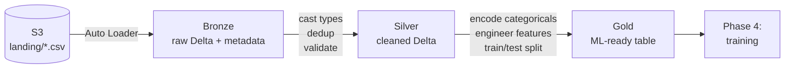

# Phase 3 — Medallion Architecture: Bronze → Silver → Gold

> **Goal:** Build the data refinement pipeline. Raw S3 files become Bronze (raw Delta), then Silver (validated), then Gold (ML-ready).

---

## 3.1 The Pattern, Visualized



The **golden rule:** each layer is *just enough* refinement. Don't apply business logic in Bronze. Don't put aggregations in Silver. Don't dump raw data into Gold.

| Layer | Catalog path | What's in it | Schema strictness |
|---|---|---|---|
| Bronze | `churn_mlops.bronze.customer_churn_raw` | Every row from every file, with `_ingest_ts`, `_source_file` metadata | Loose (strings OK) |
| Silver | `churn_mlops.silver.customer_churn` | Typed, deduplicated, validated | Strict |
| Gold | `churn_mlops.gold.customer_churn_features` | Encoded, scaled, feature-engineered | Strict (ML-ready) |

---

## 3.2 Notebook 01 — Bronze Ingestion (Auto Loader)

The `databricks/01_ingest_bronze.py` notebook uses Databricks **Auto Loader**, which incrementally reads new files from S3 (the alternative is doing it manually with a watermark file).

**Key principles:**
- Read everything as `string` (or `_corrupt_record`) at this stage — no type drift.
- Always add audit columns: `_ingest_ts`, `_source_file`.
- Append-only — Bronze is your insurance policy.

Open `databricks/01_ingest_bronze.py` in Databricks and **Run All**.

After it finishes, verify:
```sql
SELECT count(*), max(_ingest_ts)
FROM churn_mlops.bronze.customer_churn_raw;
```

---

## 3.3 Notebook 02 — Silver: Clean & Validate

`databricks/02_silver_clean.py` does:

1. **Cast types** — `senior_citizen` to int, `monthly_charges` to double, etc.
2. **Drop corrupt rows** — anything where `_corrupt_record IS NOT NULL`.
3. **Deduplicate** on `customer_id`, keeping the latest.
4. **Validate** with explicit assertions (row counts, no nulls in required cols).
5. **Quarantine** bad rows in `silver.customer_churn_quarantine`.

Run it. Confirm:
```sql
SELECT count(*), count(DISTINCT customer_id)
FROM churn_mlops.silver.customer_churn;
-- Both numbers should match.
```

---

## 3.4 Notebook 03 — Gold: Feature Engineering

`databricks/03_gold_features.py` produces the table the model will train on:

1. **Categorical encoding** — one-hot encode `contract_type`, `payment_method`, etc.
2. **Numeric scaling** — z-score `monthly_charges`, `total_charges`, `tenure_months`.
3. **Feature engineering** — `avg_charge_per_month = total_charges / tenure_months`.
4. **Target encoding** — `churn` → 0/1.
5. **Split flags** — add a `_split` column with `train/test/val` (80/10/10).

Output table:
```
churn_mlops.gold.customer_churn_features
   customer_id, [encoded features...], churn_label, _split
```

---

## 3.5 Run the Pipeline as a Databricks Job

Once the three notebooks work standalone, wire them into a **Job** so they run sequentially:

1. **Workflows** → **Create Job** → **Single task**, then **Add task** for each notebook.
2. Configure as `task_a → task_b → task_c` (dependencies in the UI).
3. Set a schedule (daily 02:00 UTC) or trigger manually.

Or define it in YAML using **Databricks Asset Bundles** (`databricks.yml` at repo root). That's the GitOps way — covered in the project's CI/CD phase.

---

## 3.6 Data Quality Tips (from production experience)

> **Tip 1: Use streaming reads from Bronze→Silver.**
> Even if your source is batch, structured-streaming reads make Bronze→Silver idempotent and incremental for free.

> **Tip 2: Quarantine, don't drop.**
> Bad rows go to a separate `*_quarantine` table. You can investigate them later.

> **Tip 3: Schema enforcement at the Silver layer.**
> Use Delta's `mergeSchema=false` (default) so unexpected new columns *fail* loudly instead of corrupting silently.

> **Tip 4: Track lineage with Unity Catalog.**
> UC builds lineage automatically. Open any table → **Lineage** tab → see exactly which upstream tables and notebooks fed it.

> **Tip 5: Don't mix concerns across layers.**
> If you find yourself adding business logic to Bronze, stop. Add it to Silver or Gold.

---

## ✅ Phase 3 Checklist

- [ ] `bronze.customer_churn_raw` has ~20 rows (from the sample data)
- [ ] `silver.customer_churn` has the same count, with proper types
- [ ] `silver.customer_churn_quarantine` exists (empty if data is clean)
- [ ] `gold.customer_churn_features` has the encoded feature columns + `_split`
- [ ] A Databricks Job orchestrates all three notebooks
- [ ] You can see lineage in the Catalog UI

**Next:** [`04-training-mlflow.md`](04-training-mlflow.md) →
