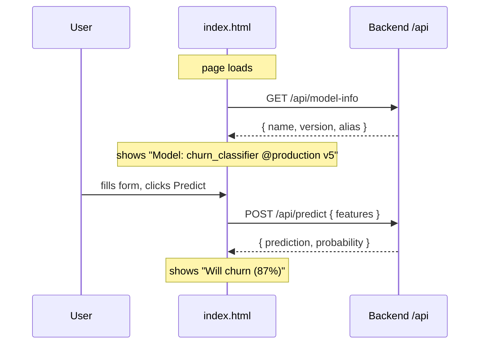

# Phase 6 — Frontend (HTML/CSS/JS)

> **Goal:** A simple single-page app with a welcome banner, a feature form, and a Predict button. Served by NGINX in the container.

---

## 6.1 Why HTML/CSS/JS (and not React)?

The user asked for HTML/CSS, which is exactly right for this tutorial:
- No build step. No `npm install`. No tooling.
- One static container, served by NGINX. Easy to dockerize.
- Easy to swap for React/Vue later if you outgrow it.

---

## 6.2 What the Page Does



---

## 6.3 Project Layout

```
frontend/
├── index.html       ← markup
├── style.css        ← styling
├── script.js        ← fetch the API
├── nginx.conf       ← serves the static files + proxies /api
└── Dockerfile
```

---

## 6.4 Running Locally

If your backend is on `localhost:8000`:

```bash
# Simple python static server
cd frontend
python -m http.server 8080

# Open http://localhost:8080
# Note: requests to /api/* will hit the page's own server (404) — for true
# local dev, run the backend & frontend together via:
docker compose -f docker-compose.dev.yml up
```

Or in production, NGINX in the frontend container proxies `/api/*` to the
backend service. See `nginx.conf`.

---

## 6.5 Production Routing

In Kubernetes, the ALB Ingress (Phase 10) sends:

| Path | Backend |
|---|---|
| `/api/*` | backend Service (port 8000) |
| `/*` | frontend Service (port 80) |

So in production the page makes a relative `fetch('/api/predict', ...)` call,
which goes through the same domain → ALB → backend pod.

---

## ✅ Phase 6 Checklist

- [ ] You can open `index.html` in a browser and see the form
- [ ] When the backend is running, model info appears in the banner
- [ ] Clicking Predict returns a result
- [ ] The dockerized frontend serves the same content via NGINX

**Next:** [`07-dockerization.md`](07-dockerization.md) →
