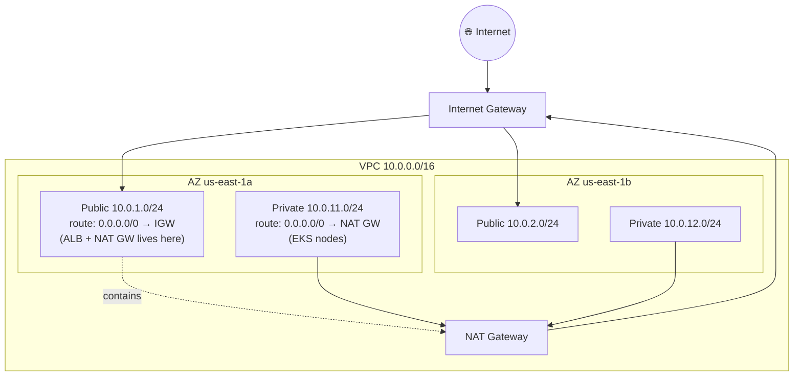

# Phase 8 — AWS VPC with Terraform

> **Goal:** Provision a production-grade VPC with public + private subnets across two AZs, an Internet Gateway for public traffic, and a NAT Gateway for private traffic.

---

## 8.1 What We're Building



**Why this layout?**

| Resource | In subnet | Why |
|---|---|---|
| **ALB** | Public | Needs an inbound public IP. Browsers connect here. |
| **EKS nodes** | Private | No public IPs — reduces attack surface. |
| **NAT Gateway** | Public | Gives private subnets outbound internet (for `docker pull`, etc.) |
| **Internet Gateway** | (attached to VPC) | Lets public subnets reach the internet. |

---

## 8.2 Why Use the Terraform Modules

We rely on `terraform-aws-modules/vpc/aws` and `terraform-aws-modules/eks/aws`. They:
- Encode AWS best practices for free.
- Save 500+ lines of low-level `aws_*` resources.
- Get audited / updated quickly when AWS releases new features.

You can absolutely hand-roll the resources, but for a tutorial we keep it idiomatic and short.

---

## 8.3 Critical Subnet Tags for the ALB Controller

The AWS Load Balancer Controller auto-discovers which subnets to put the ALB in by reading these tags:

| Tag | Where | Value |
|---|---|---|
| `kubernetes.io/role/elb` | Public subnets | `1` |
| `kubernetes.io/role/internal-elb` | Private subnets | `1` |
| `kubernetes.io/cluster/<cluster-name>` | All subnets | `shared` or `owned` |

Without these tags, your Ingress will sit stuck in `PENDING` forever and the controller logs will say "no matching subnets found". Our `vpc.tf` already adds them via `public_subnet_tags` and `private_subnet_tags`.

---

## 8.4 Initialize Terraform

First, fix the backend bucket name in `providers.tf` (or use `-backend-config`):

```bash
cd terraform

# Replace the placeholder in providers.tf
sed -i.bak "s/mlops-tfstate-CHANGEME/${TFSTATE_BUCKET}/" providers.tf

# Init pulls the modules + connects to the state backend
terraform init
```

Or pass it on the CLI:
```bash
terraform init \
   -backend-config="bucket=${TFSTATE_BUCKET}" \
   -backend-config="dynamodb_table=${TFLOCK_TABLE}"
```

Then create your `terraform.tfvars`:
```bash
cp terraform.tfvars.example terraform.tfvars
# edit terraform.tfvars (domain_name etc. — can leave blank for now)
```

---

## 8.5 Apply Just the VPC First

To avoid spending money before you're sure, apply the VPC module on its own:

```bash
terraform plan  -target=module.vpc
terraform apply -target=module.vpc
```

Verify:
```bash
aws ec2 describe-vpcs \
   --filters "Name=tag:Project,Values=churn-mlops" \
   --query "Vpcs[].{ID:VpcId,CIDR:CidrBlock,Name:Tags[?Key=='Name']|[0].Value}"
```

You should see your `churn-mlops-vpc` with `10.0.0.0/16`.

---

## 8.6 Cost Considerations

| Resource | Cost (us-east-1) |
|---|---|
| VPC, subnets, IGW, route tables | $0 |
| **NAT Gateway** | ~$0.045/hr **+** $0.045/GB processed (~$32/month idle) |
| Public IP for NAT | included |

The NAT GW is the only VPC cost. To save money in dev:
- `single_nat_gateway = true` in `vpc.tf` (our default) → one NAT for all AZs
- Replace with **NAT instance** (t3.nano) → ~$3/month but no HA
- Or drop NAT entirely if your private workloads don't need outbound internet
  *(EKS nodes do — they pull images, talk to AWS APIs)*

---

## ✅ Phase 8 Checklist

- [ ] `terraform init` succeeds; state bucket is reachable
- [ ] `terraform apply -target=module.vpc` creates VPC + subnets + IGW + NAT GW
- [ ] `aws ec2 describe-vpcs` shows your VPC
- [ ] Subnets are tagged with `kubernetes.io/role/*`

**Next:** [`09-eks-terraform.md`](09-eks-terraform.md) →
