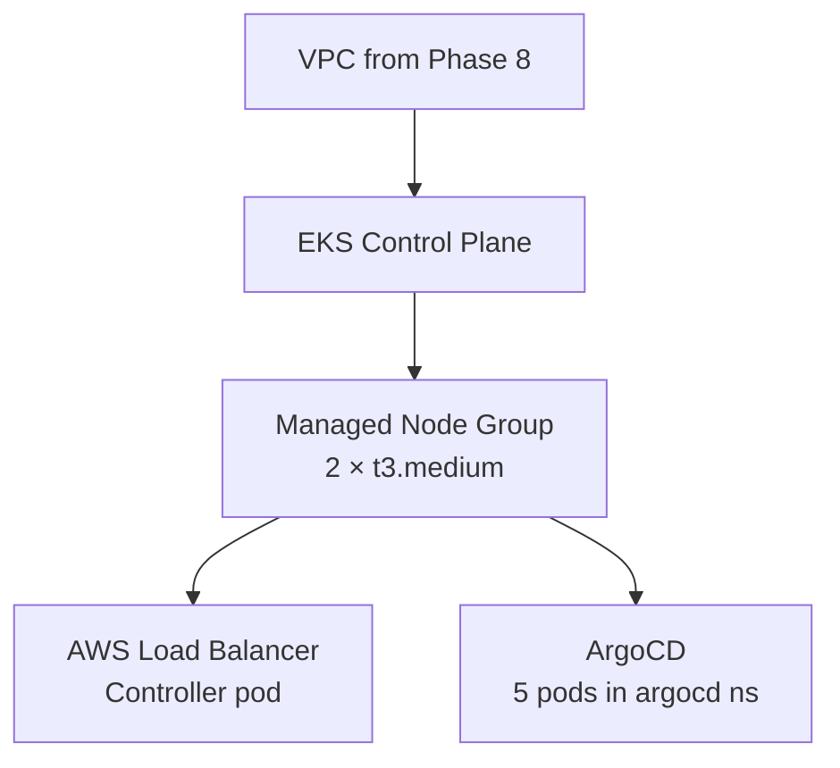
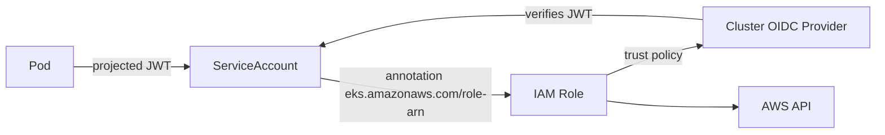

# Phase 9 — EKS Cluster with Terraform

> **Goal:** Stand up an EKS cluster in the VPC, install the AWS Load Balancer Controller via Helm + IRSA, and install ArgoCD.

---

## 9.1 What Terraform Provisions

After this phase, you'll have:



The three `.tf` files involved:
- `eks.tf` — the cluster + node group
- `alb-controller.tf` — IAM policy, IRSA, Helm release
- `argocd.tf` — Helm release in the `argocd` namespace

---

## 9.2 IAM Roles for Service Accounts (IRSA)

Some pods need AWS permissions (ALB controller, ArgoCD with S3, etc.). The wrong way is to attach permissions to the node IAM role — that gives them to *every* pod on the node.

The right way is **IRSA**:



Each pod gets a fresh, time-limited token tied to one role. Our `alb-controller.tf` uses the `iam-role-for-service-accounts-eks` module to wire this up automatically.

---

## 9.3 Apply the Full Stack

```bash
cd terraform
terraform plan
terraform apply
# type 'yes' when prompted
# Takes ~15-20 minutes — EKS control plane is the slow part
```

Watch for these in the output:
```
module.eks.aws_eks_cluster.this[0]:        Creating...        (~10 min)
module.eks.module.eks_managed_node_group:  Creating...        (~5 min)
helm_release.alb_controller:               Creating...        (~1 min)
helm_release.argocd:                       Creating...        (~2 min)
```

---

## 9.4 Configure kubectl

```bash
# Output from terraform will give you this exact command:
aws eks update-kubeconfig --region us-east-1 --name churn-mlops-eks

# Verify
kubectl get nodes
# NAME                           STATUS   ROLES    AGE   VERSION
# ip-10-0-11-145.ec2.internal    Ready    <none>   3m    v1.30.x
# ip-10-0-12-201.ec2.internal    Ready    <none>   3m    v1.30.x

kubectl get pods -A
# Should show coredns, kube-proxy, aws-load-balancer-controller, argocd-* etc.
```

---

## 9.5 Verify the ALB Controller

```bash
kubectl -n kube-system get deploy aws-load-balancer-controller
# NAME                              READY   UP-TO-DATE   AVAILABLE   AGE
# aws-load-balancer-controller      2/2     2            2           4m

kubectl -n kube-system logs deploy/aws-load-balancer-controller | head -20
# Should see "successfully started controller"
```

If the controller is in `CrashLoopBackOff`, 99% of the time it's an IAM permission issue. Check:
- The `iam_role_arn` annotation on the SA matches `module.alb_controller_irsa.iam_role_arn`
- The cluster's OIDC provider exists: `aws iam list-open-id-connect-providers`

---

## 9.6 Verify ArgoCD

```bash
kubectl -n argocd get pods
# All should be Running.

# Get the initial admin password
kubectl -n argocd get secret argocd-initial-admin-secret \
    -o jsonpath="{.data.password}" | base64 -d ; echo

# Port-forward to the UI (we're not exposing via Ingress yet)
kubectl -n argocd port-forward svc/argocd-server 8081:443
# Open https://localhost:8081  (ignore the self-signed cert warning)
# User: admin   Password: (from above)
```

---

## 9.7 What Each Cluster Add-on Does

| Add-on | What |
|---|---|
| **coredns** | In-cluster DNS (`my-service.my-ns.svc.cluster.local`) |
| **kube-proxy** | Maintains iptables rules for Service routing |
| **vpc-cni** | Gives each pod a real VPC IP (Amazon VPC CNI) |
| **aws-ebs-csi-driver** | Lets you create PersistentVolumes backed by EBS |
| **eks-pod-identity-agent** | Newer alternative to IRSA (we still use IRSA; both can coexist) |

Managed add-ons get patched automatically when AWS releases new versions.

---

## ✅ Phase 9 Checklist

- [ ] `terraform apply` completes without errors
- [ ] `kubectl get nodes` shows 2 ready nodes
- [ ] `kubectl -n kube-system get deploy aws-load-balancer-controller` is 2/2 ready
- [ ] `kubectl -n argocd get pods` shows all ArgoCD pods running
- [ ] You can log into ArgoCD UI via port-forward

**Next:** [`10-ingress-alb-route53.md`](10-ingress-alb-route53.md) →
