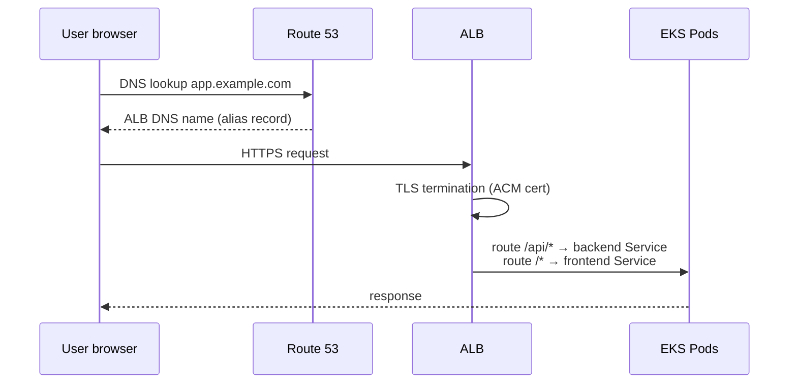

# Phase 10 — Ingress + ALB + Route 53 + Custom Domain

> **Goal:** Get HTTPS traffic to `https://app.yourdomain.com` flowing into your two pods.

---

## 10.1 The Flow



Four pieces:
1. **K8s Ingress** (yaml in your repo) — declares routing rules.
2. **AWS Load Balancer Controller** — sees the Ingress, calls AWS APIs to create the ALB.
3. **ACM Certificate** — for HTTPS at the ALB.
4. **Route 53 Record** — points your domain at the ALB.

---

## 10.2 Step 1: Request an ACM Certificate

```bash
# In your AWS region — same region as your EKS cluster!
aws acm request-certificate \
    --domain-name "*.example.com" \
    --validation-method DNS \
    --region us-east-1
```

This returns a `CertificateArn`. Then:
1. Open ACM console → click the new cert → "Create records in Route 53" (only works if your domain's nameservers point to Route 53).
2. Wait ~5 minutes; status becomes **Issued**.

Save the ARN. You'll paste it into `k8s/ingress.yaml` and `terraform.tfvars`.

---

## 10.3 Step 2: Make Sure Your Domain Uses Route 53

If you bought your domain at GoDaddy/Namecheap/etc., you can either:

**(a)** Transfer the domain to Route 53 (~$12/year), or
**(b)** Create a Route 53 hosted zone and update your registrar's nameservers to point to the Route 53 NS records.

Option (b) is free and what we recommend for a tutorial:

```bash
aws route53 create-hosted-zone \
    --name example.com \
    --caller-reference "$(date +%s)"

# Copy the four NS records from the output, then paste them into your
# registrar's DNS settings.
```

---

## 10.4 Step 3: Apply Kubernetes Manifests

```bash
# (re-)apply
kubectl apply -f k8s/namespace.yaml
kubectl apply -f k8s/backend/
kubectl apply -f k8s/frontend/
kubectl apply -f k8s/ingress.yaml

# Watch the ALB get provisioned (takes ~2 min)
kubectl get ingress -n churn -w
# NAME            CLASS   HOSTS              ADDRESS                                                 PORTS
# churn-ingress   alb     app.example.com    k8s-churn-churnin-xxxxx-1234567890.us-east-1.elb.amazonaws.com   80
```

Once the `ADDRESS` column is populated, the ALB exists.

---

## 10.5 Step 4: Point Route 53 at the ALB

Two ways:

**(a) Via Terraform** — uncomment `domain_name` and `app_subdomain` in your `terraform.tfvars`, then:
```bash
terraform apply -target=aws_route53_record.app
```

**(b) Manually** — in the Route 53 console:
- Records → Create record
- Name: `app`
- Type: `A`
- **Alias** → toggle on → "Alias to Application and Classic Load Balancer"
- Choose your region and the ALB you just created
- Routing policy: Simple
- Create

---

## 10.6 Step 5: Enable HTTPS at the ALB

Edit `k8s/ingress.yaml`:
1. Uncomment the four TLS-related annotations.
2. Paste your ACM cert ARN.
3. `kubectl apply -f k8s/ingress.yaml`.
4. Within ~30 s, the ALB starts listening on 443 and force-redirects HTTP → HTTPS.

---

## 10.7 Step 6: Test It

```bash
curl https://app.example.com/api/health
# {"status":"ok"}

curl https://app.example.com/api/model-info
# {"name":"churn_mlops.models.churn_classifier","version":"5","alias":"production","flavor":"sklearn"}

# Open the UI:
open https://app.example.com
```

---

## 10.8 Troubleshooting

> **Ingress shows no ADDRESS after 5 min.**
> Check the ALB controller logs:
> ```bash
> kubectl -n kube-system logs deploy/aws-load-balancer-controller --tail=80
> ```
> Most common: subnet tags missing (re-check Phase 8.3) or the controller's IRSA role lacks the new IAM permissions.

> **ALB exists but health checks fail (Target group "unhealthy").**
> The ALB is hitting `/` on your pods by default. Our Ingress correctly routes `/api/*` to the backend, but the ALB still does health checks per-target-group at the path the backend Service exposes. The `healthcheck-path` annotation can override per Service:
> ```yaml
> alb.ingress.kubernetes.io/healthcheck-path: /health
> ```
> Add it to the Ingress if needed.

> **502 Bad Gateway from the ALB.**
> Usually means the backend pod isn't Ready. Check:
> ```bash
> kubectl -n churn get pods
> kubectl -n churn describe pod -l app=backend
> ```

> **CORS errors in the browser console.**
> The frontend and backend share the same domain via the ALB, so CORS should not be needed. But if you test cross-origin locally, set `CORS_ORIGINS=http://localhost:8080` on the backend.

---

## ✅ Phase 10 Checklist

- [ ] ACM certificate is **Issued**
- [ ] Route 53 hosted zone exists, nameservers match registrar
- [ ] `kubectl get ingress -n churn` shows an ADDRESS
- [ ] Route 53 A-alias `app.example.com` resolves to the ALB
- [ ] `https://app.example.com/api/health` returns 200
- [ ] Loading the UI shows the model info banner

**Next:** [`11-cicd-github-actions.md`](11-cicd-github-actions.md) →
