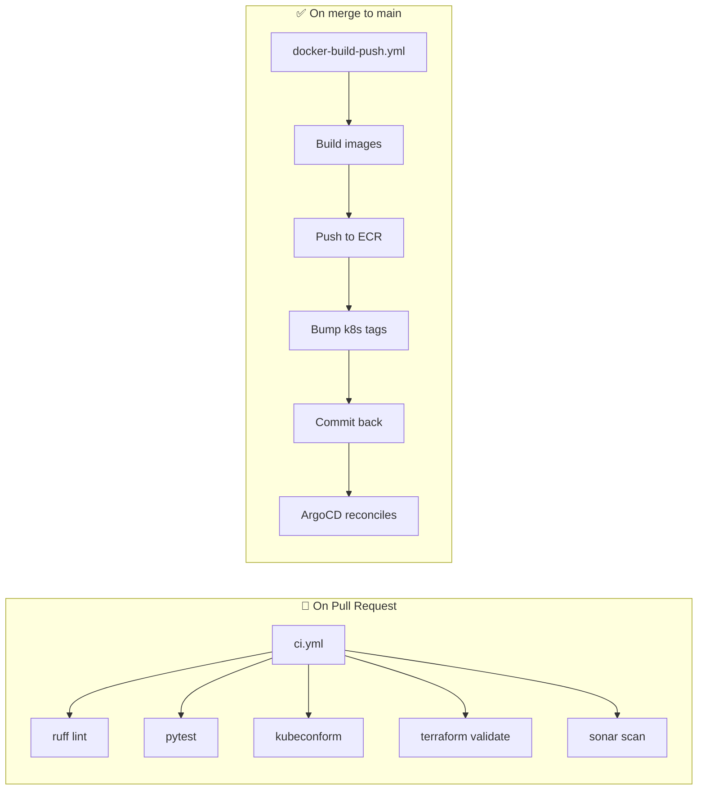

# Phase 11 — CI with GitHub Actions

> **Goal:** Every PR runs tests and validation. Every merge to `main` builds container images, pushes them to ECR, and bumps the image tags in `k8s/` so ArgoCD picks them up.

---

## 11.1 The Two Workflows



Files:
- `.github/workflows/ci.yml` — gates PRs.
- `.github/workflows/docker-build-push.yml` — ships images.
- `.github/workflows/sonar.yml` — code quality (Phase 13).

---

## 11.2 Secrets You Need to Configure

In **GitHub repo → Settings → Secrets and variables → Actions**:

| Name | Where | What |
|---|---|---|
| `AWS_ROLE_ARN` | Secret | ARN of an IAM role this repo can assume (see 11.3) |
| `AWS_REGION` | Variable | e.g. `us-east-1` |
| `AWS_ACCOUNT_ID` | Variable | Your 12-digit AWS account |
| `SONAR_TOKEN` | Secret | From SonarCloud (Phase 13) |

---

## 11.3 GitHub → AWS OIDC Trust (Replaces Long-Lived Keys)

The old way: store an `AWS_ACCESS_KEY_ID` secret. Bad — long-lived, leaks easily.

The new way: GitHub Actions exchanges its OIDC token for a short-lived AWS role session.

Setup once:

```bash
# 1. Add GitHub's OIDC provider to your AWS account
aws iam create-open-id-connect-provider \
  --url   "https://token.actions.githubusercontent.com" \
  --client-id-list "sts.amazonaws.com" \
  --thumbprint-list "6938fd4d98bab03faadb97b34396831e3780aea1"

# 2. Create an IAM role that the GH workflow can assume
cat > trust.json <<'EOF'
{
  "Version": "2012-10-17",
  "Statement": [{
    "Effect": "Allow",
    "Principal": {
      "Federated": "arn:aws:iam::<AWS_ACCOUNT>:oidc-provider/token.actions.githubusercontent.com"
    },
    "Action": "sts:AssumeRoleWithWebIdentity",
    "Condition": {
      "StringEquals": { "token.actions.githubusercontent.com:aud": "sts.amazonaws.com" },
      "StringLike":   {
        "token.actions.githubusercontent.com:sub": "repo:<GH_OWNER>/mlops-e2e:*"
      }
    }
  }]
}
EOF

aws iam create-role --role-name gh-mlops-e2e \
    --assume-role-policy-document file://trust.json

# 3. Attach permissions — for the tutorial we use the ECR managed policy
aws iam attach-role-policy --role-name gh-mlops-e2e \
    --policy-arn arn:aws:iam::aws:policy/AmazonEC2ContainerRegistryPowerUser
```

Then put `arn:aws:iam::<account>:role/gh-mlops-e2e` into the `AWS_ROLE_ARN` secret.

---

## 11.4 What the Build-Push Workflow Does

Annotated walkthrough:

1. **`actions/checkout` with `token`** — so the bot can later push the bumped tags back.
2. **Compute short SHA** — used as the immutable image tag (`9a8f7e6` etc.).
3. **`configure-aws-credentials`** — does the OIDC swap, gets a 1-hour role session.
4. **`amazon-ecr-login`** — `docker login` to ECR.
5. **Build + push** — backend + frontend in parallel.
6. **`sed` over the k8s manifests** — replaces `image: …:latest` with `image: …:<sha>`.
7. **Commit & push back to `main`** — the `[skip ci]` in the message prevents an infinite loop.
8. **ArgoCD's next reconcile loop (~3 minutes)** notices the change and rolls out.

---

## 11.5 Why GitHub Actions and not Jenkins / GitLab

| Tool | Pros | Cons |
|---|---|---|
| **GitHub Actions** | Free for public repos, native, easy OIDC | Tied to GitHub |
| GitLab CI | Same VCS+CI | Have to be on GitLab |
| Jenkins | Battle-tested, plugin ecosystem | Self-hosted, plugin sprawl |
| CircleCI | Fast, nice UI | Yet another vendor + bill |

For a tutorial GitHub Actions wins on simplicity.

---

## 11.6 Local Dry-Run

To test workflows without pushing:
```bash
# Install `act` — runs Actions locally in Docker
brew install act          # or `gh extension install nektos/act`

# Run the CI workflow
act pull_request -W .github/workflows/ci.yml
```

---

## ✅ Phase 11 Checklist

- [ ] `AWS_ROLE_ARN`, `AWS_REGION`, `AWS_ACCOUNT_ID` set in GH
- [ ] OIDC provider + IAM role configured in AWS
- [ ] Opening a PR triggers `CI` workflow → all green
- [ ] Merging to `main` triggers `Build & push` → new ECR image
- [ ] `k8s/backend/deployment.yaml` shows the bumped tag

**Next:** [`12-argocd-gitops.md`](12-argocd-gitops.md) →
