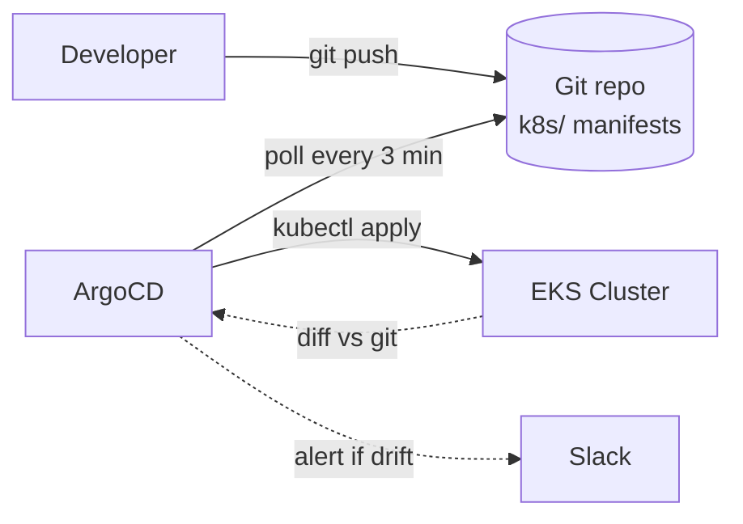

# Phase 12 — CD with ArgoCD (GitOps)

> **Goal:** Replace manual `kubectl apply` with a controller that watches your Git repo and reconciles the cluster to match.

---

## 12.1 What GitOps Actually Means

**The single source of truth is Git, not the cluster.**



Consequences:
1. **No more `kubectl apply` from your laptop.** Edits go through PRs.
2. **Drift detection** — if anyone (or anything) modifies the cluster manually, ArgoCD shows it as `OutOfSync` and (with `selfHeal: true`) reverts it.
3. **Audit trail** — `git log` IS your deployment history.
4. **Rollbacks** = `git revert`.

---

## 12.2 The Three Apps We Register

Each ArgoCD `Application` resource defines one slice of the cluster:

| App | Path watched | What lives there |
|---|---|---|
| `churn-ingress` | `k8s/` (namespace.yaml + ingress.yaml) | Shared infra |
| `churn-backend` | `k8s/backend/` | Backend Deployment + Service |
| `churn-frontend` | `k8s/frontend/` | Frontend Deployment + Service |

Why three apps? **Blast radius.** If the frontend manifest goes red, the backend app doesn't get blocked. Each is sync'd independently.

---

## 12.3 Bootstrap

Once. After Terraform installed ArgoCD in Phase 9:

```bash
# 1. Edit the three Application YAMLs to point at YOUR Git repo
sed -i.bak "s|<your-user>|YOUR-GITHUB-USERNAME|g" k8s/argocd-apps/*.yaml

# 2. Apply them
kubectl apply -f k8s/argocd-apps/

# 3. Check status
kubectl get applications -n argocd
# NAME             SYNC STATUS   HEALTH STATUS
# churn-backend    Synced        Healthy
# churn-frontend   Synced        Healthy
# churn-ingress    Synced        Healthy
```

---

## 12.4 Watching Sync

```bash
# Via CLI
argocd app list                        # needs `argocd login` first
argocd app get churn-backend
argocd app sync churn-backend          # force a sync

# Via UI (port-forward from Phase 9)
kubectl -n argocd port-forward svc/argocd-server 8081:443
# → https://localhost:8081
```

The UI is genuinely lovely — it visualizes every resource, owner refs, sync status, last sync, etc.

---

## 12.5 The Sync Loop

By default, ArgoCD polls every **3 minutes**. To make it faster for testing, lower the global interval (Phase 9's helm release) or trigger manually:

```bash
argocd app sync churn-backend --grpc-web
```

In production, **set up a GitHub webhook** so ArgoCD reacts instantly:
- ArgoCD UI → Settings → Repositories → your repo → **Setup webhook**
- Or pass the secret-laden URL `https://<argocd>/api/webhook` to GitHub.

---

## 12.6 syncPolicy Knobs

Our backend app uses:
```yaml
syncPolicy:
  automated:
    prune:    true       # delete resources removed from git
    selfHeal: true       # revert manual cluster edits
  syncOptions:
    - CreateNamespace=true
    - ServerSideApply=true
  retry:
    limit: 5
    backoff: ...
```

| Option | What |
|---|---|
| `automated.prune` | Delete cluster resources that no longer exist in git |
| `automated.selfHeal` | Revert manual `kubectl edit` changes |
| `CreateNamespace=true` | Auto-create the target namespace |
| `ServerSideApply=true` | Use SSA (better for large CRDs, fewer conflicts) |

> **Caution:** `selfHeal` + `prune` are aggressive. Test in dev first; in prod many teams disable auto-prune and require a manual sync click for destructive changes.

---

## 12.7 Rolling Back

```bash
# Find the previous git commit
git log --oneline k8s/backend/

# Revert
git revert <bad-sha>
git push origin main

# ArgoCD picks it up within 3 min (or use the webhook)
```

Or roll back via the UI: **App → History → click an older revision → Rollback**.

---

## ✅ Phase 12 Checklist

- [ ] The three Application resources show `Synced / Healthy`
- [ ] Pushing a change to `k8s/backend/deployment.yaml` triggers a rollout
- [ ] You can see the rollout in the ArgoCD UI
- [ ] `kubectl get pods -n churn` shows fresh pods after a deploy

**Next:** [`13-sonarqube.md`](13-sonarqube.md) →
